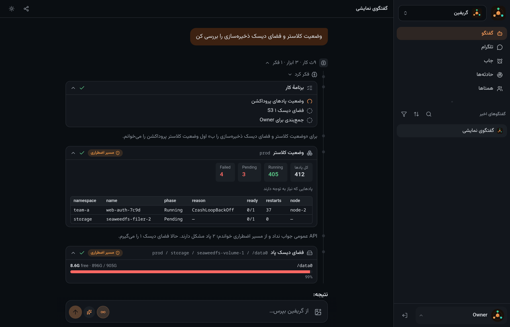
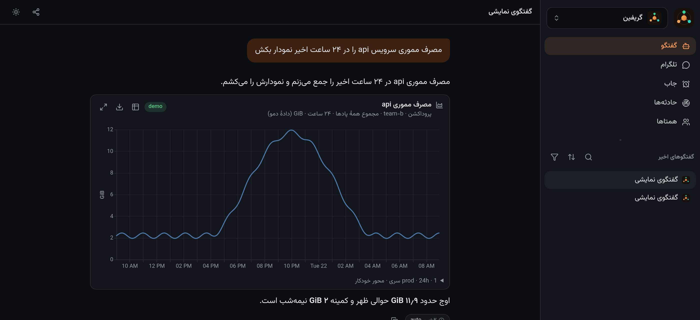

# Griffin

**A self-hosted shell for a small team of agents that work for you.** You make the agents — what
each one is, what it may touch, who may ask it — and they answer from typed tools instead of from
the model's memory.

`Node 24` · `Cursor or Claude Agent SDK` · `SQLite` · no SaaS control plane · MIT



## Two minutes to your own

```bash
git clone <this repo> griffin && cd griffin
npm ci && npm run build

mkdir -p data workspace
echo "sk-ant-…" > data/anthropic.api-key && chmod 600 data/anthropic.api-key   # or data/cursor.api-key
GRIFFIN_DATA=./data GRIFFIN_WORKSPACE=./workspace PORT=3100 node apps/server/src/index.mjs
```

Open `http://127.0.0.1:3100`, log in with the token printed at `data/owner.token` (or start with
`GRIFFIN_AUTH=off` while you are on localhost), and start talking to the agent that is already
there. No cluster, no vault, no YAML: a fresh install is a chat with one agent, and everything else
is something you add when you want it.

Prefer Docker? `docker compose -f deploy/compose.yaml up -d --build` runs the same thing.

To look around before wiring anything up, `GRIFFIN_DEMO=1 GRIFFIN_AUTH=off …` replaces the model
with a scripted stand-in — the screenshots on this page are that demo.

## Make an agent

**#/agents → ایجنت جدید**: an id, a name, one line about its job, and its instructions. Then switch
on the tools it may use, and say who may call it — the owner, another agent, a scheduled job, a
colleague on a messenger, or an external agent over MCP — and which of its tools each of them gets.

Agents are rows in a table, not code. Quotas are enforced where tools are handed to the model, so a
tool a caller was not given does not exist for that run. [`docs/agents.md`](docs/agents.md) explains
the model; [`examples/agents/`](examples/agents) has profiles you can import as a starting point
(a researcher that only reads, an infrastructure agent, two CDN agents).

## What you get

**Agents that delegate.** `delegate` returns immediately and reports back when the subtask lands, so
the agent you are talking to stays free; `ask_agent` is the short blocking variant. Each agent picks
its own engine (Cursor or Claude) and model.

**Charts and files in the conversation** — the agent draws Vega-Lite from real rows, and images,
video, PDF, Markdown and CSV render inline. The same chart goes to a messenger as an image.



**Scheduled jobs** — a prompt, a trigger and a delivery target; each run gets its own hidden chat,
so a job that misbehaves leaves the same trace a person's chat would.

**Messengers and other agents** — Telegram/Bale bots and a Telegram account bridge; an MCP endpoint
where another agent (Claude Code, for instance) connects with its own scoped token and gets
task-shaped tools: send, wait, reply, cancel.

**Infrastructure tools, if you want them.** A separate broker process holds credentials and exposes
typed tools: Kubernetes (status, get, logs, in-pod `df`, secrets, CNPG), Prometheus and Grafana
(including running a dashboard panel's own query), PostgreSQL, S3, GitLab, MikroTik routers,
ArvanCloud and NSIN CDNs, DNS/HTTP/TLS probes. Each pack appears only once you configure what it
needs, so an agent never sees a tool that cannot work.

The UI is Persian-first and right-to-left; the code, tools and docs are English.

## How it fits together

```
browser · Telegram · MCP client
            │
     ┌──────▼─────────────────────────┐
     │ app     chats, agents, jobs,   │  holds the model key
     │         charts, files, MCP     │  no infrastructure credentials, no shell
     └──────┬─────────────────────────┘
            │ unix socket · typed JSON tools     (optional)
     ┌──────▼─────────────────────────┐
     │ broker  kube · metrics · pg    │  holds every credential
     │         s3 · gitlab · routers  │  guards enforced in code
     └────────────────────────────────┘  public API first, emergency SSH second
```

The split is the point: the process running the model holds no credential and has no shell, and the
process that holds them exposes only named tools with schemas. More in
[docs/architecture.md](docs/architecture.md).

The second point is that it keeps working when what it is watching does not: every cluster tool
tries the public API first and falls back to SSH on a node, and every answer says which path
produced it.

## Add your infrastructure (when you need it)

1. Copy `config/site.example.json` to `config/site.json` and describe your world: clusters and their
   emergency SSH paths, GitLab, object storage, routers, shell hosts.
2. Put the credentials in a vault (OpenBao/Vault KV) — [`docs/configuration.md`](docs/configuration.md)
   lists the item names the broker looks up.
3. Start the broker: `COMPOSE_PROFILES=tools docker compose -f deploy/compose.yaml up -d --build`.
4. In **#/agents**, switch the new tools on for the agent that should have them — or import
   `examples/agents/platform.json` and edit it.

**This repository ships no environment.** There are no hosts, clusters, tokens or organisation
knowledge in it: unconfigured tools say "not configured" instead of guessing an endpoint, and the
tests declare their own fixture site.

## Layout

| Path | What |
|---|---|
| `apps/server/` | Hono + SQLite + SSE, agent runtime, auth, jobs, incidents, MCP |
| `apps/broker/` | every credential, typed tools over a unix socket, guards in code |
| `apps/web/` | the UI (assistant-ui + streamdown, RTL, PWA) |
| `packages/timeline/` | folds stored events into messages (shared by server and UI) |
| `config/` | the site inventory shape |
| `examples/agents/` | importable agent profiles |
| `deploy/` | compose, environment example, egress proxy notes, backup script |
| `docs/` | [agents](docs/agents.md) · [architecture](docs/architecture.md) · [configuration](docs/configuration.md) |

## Security posture

- The agent process has no shell tool and no infrastructure credential; the broker holds them and
  never returns a secret value to the model.
- Tool access is filtered per caller before the tools reach the model — quota is code, not prompt
  text — and a caller with no quota row gets nothing.
- Write tools are narrow by construction: router changes only touch items Griffin itself created, S3
  is GET/HEAD only, `gitlab_propose` opens a draft MR on a new branch and never merges, secret copies
  return key names only.
- Irreversible actions ask the owner and wait; in an unattended chain (a job, the ops room) they are
  refused rather than guessed. Every approval is recorded.
- Owner auth is local (token → signed cookie) so it keeps working when your SSO is down. Put it
  behind TLS you control; it is not built to face the open internet unauthenticated.

Read the code before you point this at production: it is opinionated, and the guards assume one
owner.

## License

MIT — see [LICENSE](LICENSE).
